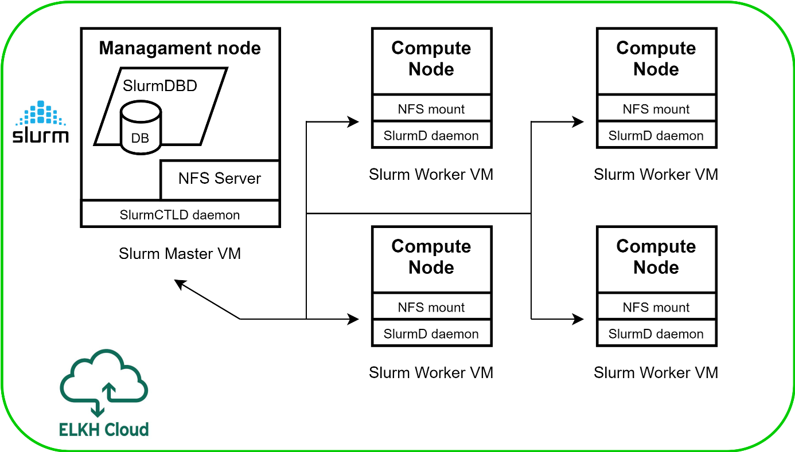
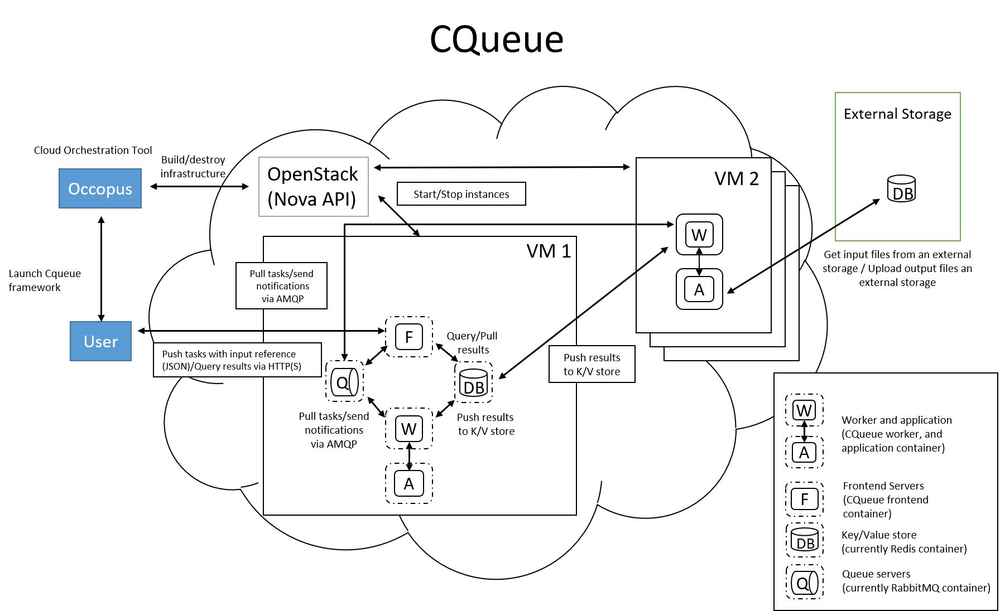

.. _tutorial-building-clusters:

Building clusters
=================

Docker-Swarm cluster
~~~~~~~~~~~~~~~~~~~~

This tutorial sets up a complete Docker infrastructure with Swarm, Docker and Consul software components. It contains a master node and predefined number of worker nodes. The worker nodes receive the ip of the master node and attach to the master node to form a cluster. Finally, the docker cluster can be used with any standard tool talking the docker protocol (on port ``2375``).

**Features**

  - creating two types of nodes through contextualisation
  - passing ip address of a node to another node
  - using the cloudsigma resource handler
  - utilising health check against a predefined port
  - using parameters to scale up worker nodes

**Prerequisites**

  - accessing an Occopus compatible interface
  - target cloud contains an Ubuntu 18.04 image with cloud-init support

**Download**

You can download the example as `tutorial.examples.docker-swarm <https://raw.githubusercontent.com/occopus/docs/devel/tutorials/docker-swarm.tar.gz>`_ .

**Steps**

The following steps are suggested to be performed:

#. Open the file ``nodes/node_definitions.yaml`` and edit the resource section of the nodes labelled by ``node_def:``.

    - you must select an :ref:`Occopus compatible resource plugin <user-doc-clouds>`
    - you can find and specify the relevant :ref:`list of attributes for the plugin <userdefinitionresourcesection>`
    - you may follow the help on :ref:`collecting the values of the attributes for the plugin <user-doc-collecting-resources>`
    - you may find a resource template for the plugin in the :ref:`resource plugin tutorials <tutorial-resource-plugins>`

    The downloadable package for this example contains a resource template for the Cloudsigma plugin.

#. Components in the infrastructure connect to each other, therefore several port ranges must be opened for the VMs executing the components. Clouds implement port opening various way (e.g. security groups for OpenStack, etc). Make sure you implement port opening in your cloud for the following port ranges:

    ===========     =============  ====================
    Protocol        Port(s)        Service
    ===========     =============  ====================
    TCP             2375           web listening port (configurable*)
    TCP             2377           for cluster management & raft sync communications
    TCP and UDP     7946           for "control plane" gossip discovery communication between all nodes
    ===========     =============  ====================

    .. note::
        Do not forget to open the ports which are needed for your Docker application!

#. Make sure your authentication information is set correctly in your authentication file. You must set your email and password in the authentication file. Setting authentication information is described :ref:`here <authentication>`.

#. Load the node definition for ``dockerswarm_master_node`` and ``dockerswarm_worker_node`` nodes into the database.

    .. important::

        Occopus takes node definitions from its database when builds up the infrastructure, so importing is necessary whenever the node definition (file) changes!

    .. code:: bash

        occopus-import nodes/node_definitions.yaml

#. Update the number of worker nodes if necessary. For this, edit the ``infra-docker-swarm.yaml`` file and modify the ``min`` parameter under the ``scaling`` keyword. Currently, it is set to ``2``.

    .. code:: yaml

        - &W
            name: worker
            type: dockerswarm_worker_node
            scaling:
                min: 2

#. Start deploying the infrastructure. Make sure the proper virtualenv is activated!

    .. code:: bash

        occopus-build infra-docker-swarm.yaml

    .. note::

        It may take a few minutes until the services on the master node come to live. Please, be patient!

#. After successful finish, the node with ``ip address`` and ``node id`` are listed at the end of the logging messages and the identifier of the newly built infrastructure is printed. You can store the identifier of the infrastructure to perform further operations on your infra or alternatively you can query the identifier using the **occopus-maintain** command.

    .. code:: bash

        List of nodes/ip addresses:
        master:
        <ip-address> (dfa5f4f5-7d69-432e-87f9-a37cd6376f7a)
        worker:
        <ip-address> (cae40ed8-c4f3-49cd-bc73-92a8c027ff2c)
        <ip-address> (8e255594-5d9a-4106-920c-62591aabd899)
        77cb026b-2f81-46a5-87c5-2adf13e1b2d3

#. Check the result by submitting docker commands to the docker master node!

#. Finally, you may destroy the infrastructure using the infrastructure id returned by ``occopus-build``

    .. code:: bash

        occopus-destroy -i 77cb026b-2f81-46a5-87c5-2adf13e1b2d3

Kubernetes cluster
~~~~~~~~~~~~~~~~~~~~

This tutorial sets up a complete Kubernetes infrastructure with Kubernetes Dashboard and Helm package manager. It contains a master node and predefined number of worker nodes. The worker
nodes receive the ip of the master node and attach to the master node to form a cluster. Finally, the Kubernetes cluster can be used with any standard tool talking the Kubernetes API server
protocol (on port 6443).

**Features**

 - creating two types of nodes through contextualisation
 - passing ip address of a node to another node
 - using the nova resource handler
 - utilising health check against a predefined port
 - using parameters to scale up worker nodes

**Prerequisites**

 - accessing an Occopus compatible interface
 - target cloud contains an Ubuntu 18.04 image with cloud-init support

**Download**

You can download the example as `tutorial.examples.kubernetes <https://raw.githubusercontent.com/occopus/docs/devel/tutorials/kubernetes-cluster.tar.gz>`_ .

**Steps**

The following steps are suggested to be performed:

#. Open the file ``nodes/node_definitions.yaml`` and edit the resource section of the nodes labelled by ``node_def:``.

    - you must select an :ref:`Occopus compatible resource plugin <user-doc-clouds>`
    - you can find and specify the relevant :ref:`list of attributes for the plugin <userdefinitionresourcesection>`
    - you may follow the help on :ref:`collecting the values of the attributes for the plugin <user-doc-collecting-resources>`
    - you may find a resource template for the plugin in the :ref:`resource plugin tutorials <tutorial-resource-plugins>`

    The downloadable package for this example contains a resource template for the Cloudsigma plugin.

#. Components in the infrastructure connect to each other, therefore several port ranges must be opened for the VMs executing the components. Clouds implement port opening various way (e.g. security groups for OpenStack, etc). Make sure you implement port opening in your cloud for the following port ranges:

    ===========     =============  ====================
    Protocol        Port(s)        Service
    ===========     =============  ====================
    TCP             2379-2380      etcd server client API
    TCP             6443           Kubernetes API server
    TCP             10250          Kubelet API
    TCP             10251          kube-scheduler
    TCP             10252          kube-controller-manager
    TCP             10255          read-only kubelet API
    TCP             30000-32767    NodePort Services
    ===========     =============  ====================

    .. note::

        Do not forget to open the ports which are needed for your Kubernetes application!

#. Make sure your authentication information is set correctly in your authentication file. You must set your email and password in the authentication file. Setting authentication information is described :ref:`here <authentication>`.

#. Load the node definition for ``kubernetes_master_node`` and ``kubernetes_slave_node`` nodes into the database.

    .. note::

        Make sure the proper virtualenv is activated! (source occopus/bin/activate)

    .. important::

        Occopus takes node definitions from its database when builds up the infrastructure, so importing is necessary whenever the node definition (file) changes!

    .. code:: bash

        occopus-import nodes/node_definitions.yaml

#. Update the number of worker nodes if necessary. For this, edit the ``infra-kubernetes.yaml`` file and modify the ``min`` parameter under the ``scaling`` keyword. Currently, it is set to ``2``.

    .. code:: yaml

        - &W
            name: kubernetes-slave
            type: kubernetes_slave_node
            scaling:
                min: 2

#. Start deploying the infrastructure.

    .. code:: bash

        occopus-build infra-kubernetes.yaml

    .. note::

        It may take a few minutes until the services on the master node come to live. Please, be patient!

#. After successful finish, the node with ``ip address`` and ``node id`` are listed at the end of the logging messages and the identifier of the newly built infrastructure is printed. You can store the identifier of the infrastructure to perform further operations on your infra or alternatively you can query the identifier using the **occopus-maintain** command.

    .. code:: bash

        List of nodes/ip addresses:
        master:
            <ip-address> (dfa5f4f5-7d69-432e-87f9-a37cd6376f7a)
        worker:
            <ip-address> (cae40ed8-c4f3-49cd-bc73-92a8c027ff2c)
            <ip-address> (8e255594-5d9a-4106-920c-62591aabd899)
        77cb026b-2f81-46a5-87c5-2adf13e1b2d3

#. You can check the health and statistics of the cluster. Please login to the master node via SSH connection.

    .. note::

        Before you run the command below, please make sure you use the correct user (kubeuser).

    Switch to kubeuser:

    .. code:: bash

        $ sudo su - kubeuser

    Check the nodes added to the cluster with the following command:

    .. code:: bash

        $ kubectl get nodes
        NAME                                                             STATUS   ROLES    AGE    VERSION
        occopus-kubernetes-cluster-a67dcbea-kubernetes-master-90d7cfdd   Ready    master   12m    v1.18.3
        occopus-kubernetes-cluster-a67dcbea-kubernetes-slave-a8962b51    Ready    worker   4m7s   v1.18.3
        occopus-kubernetes-cluster-a67dcbea-kubernetes-slave-ed210ec4    Ready    worker   4m7s   v1.18.3

    Ensure that Kubernetes services have been set up correctly.

    .. code:: bash

        $ kubectl get pods --all-namespaces
        NAMESPACE              NAME                                                                                     READY   STATUS    RESTARTS   AGE
        kube-system            coredns-66bff467f8-ltkkc                                                                 1/1     Running   0          12m
        kube-system            coredns-66bff467f8-ndh88                                                                 1/1     Running   0          12m
        kube-system            etcd-occopus-kubernetes-cluster-a67dcbea-kubernetes-master-90d7cfdd                      1/1     Running   0          12m
        kube-system            kube-apiserver-occopus-kubernetes-cluster-a67dcbea-kubernetes-master-90d7cfdd            1/1     Running   0          12m
        kube-system            kube-controller-manager-occopus-kubernetes-cluster-a67dcbea-kubernetes-master-90d7cfdd   1/1     Running   0          12m
        kube-system            kube-flannel-ds-amd64-5ptjb                                                              1/1     Running   0          4m23s
        kube-system            kube-flannel-ds-amd64-dfczs                                                              1/1     Running   0          12m
        kube-system            kube-flannel-ds-amd64-dqjg2                                                              1/1     Running   0          4m23s
        kube-system            kube-proxy-f8czw                                                                         1/1     Running   0          12m
        kube-system            kube-proxy-hlvd6                                                                         1/1     Running   0          4m23s
        kube-system            kube-proxy-vlwk2                                                                         1/1     Running   0          4m23s
        kube-system            kube-scheduler-occopus-kubernetes-cluster-a67dcbea-kubernetes-master-90d7cfdd            1/1     Running   0          12m
        kube-system            tiller-deploy-55bbcfbbc8-fj8mm                                                           1/1     Running   0          9m16s
        kubernetes-dashboard   dashboard-metrics-scraper-6b4884c9d5-w6rx6                                               1/1     Running   0          12m
        kubernetes-dashboard   kubernetes-dashboard-64794c64b8-sb9m6                                                    1/1     Running   0          12m

        You can access Dashboard at ``http://localhost:8001/api/v1/namespaces/kubernetes-dashboard/services/https:kubernetes-dashboard:/proxy/#/login``.

        On the login page please click on the SKIP button.

#. Finally, you may destroy the infrastructure using the infrastructure id returned by ``occopus-build``

    .. code:: bash

        occopus-destroy -i 77cb026b-2f81-46a5-87c5-2adf13e1b2d3

Slurm cluster
~~~~~~~~~~~~~~~~~~~~

Slurm is an open source, fault-tolerant, and highly scalable cluster management and job scheduling system for large and small Linux clusters. Slurm requires no kernel modifications for its operation and is relatively self-contained. As a cluster workload manager, Slurm has three key functions:

    - First, it allocates exclusive and/or non-exclusive access to resources (compute nodes) to users for some duration of time so they can perform work.
    - Second, it provides a framework for starting, executing, and monitoring work (normally a parallel job) on the set of allocated nodes.
    - Finally, it arbitrates contention for resources by managing a queue of pending work.

This tutorial sets up a complete Slurm (version **19.05.5**) infrastructure. It contains a Slurm Management (master) node and Slurm Compoute (worker) nodes, which can be scaled up or down.

    Figure 2. Slurm cluster architecture

**Features**

    - creating two types of nodes through contextualisation
    - utilising health check against a predefined port
    - using cron jobs to scale Slurm Compute nodes automatically

**Prerequisites**

    - accessing an Occopus compatible interface
    - target cloud contains an Ubuntu 18.04 image with cloud-init support

**Download**

You can download the example as `tutorial.examples.slurm <https://raw.githubusercontent.com/occopus/docs/devel/tutorials/slurm-cluster.tar.gz>`_ .

**Steps**

The following steps are suggested to be performed:

#. Open the file ``nodes/node_definitions.yaml`` and edit the resource section of the nodes labelled by ``node_def:``.

    - you must select an :ref:`Occopus compatible resource plugin <user-doc-clouds>`
    - you can find and specify the relevant :ref:`list of attributes for the plugin <userdefinitionresourcesection>`
    - you may follow the help on :ref:`collecting the values of the attributes for the plugin <user-doc-collecting-resources>`
    - you may find a resource template for the plugin in the :ref:`resource plugin tutorials <tutorial-resource-plugins>`

    The downloadable package for this example contains a resource template for the nova plugin.

#. Components in the infrastructure connect to each other, therefore several port ranges must be opened for the VMs executing the components. Clouds implement port opening various way (e.g. security groups for OpenStack, etc). Make sure you implement port opening in your cloud for the following port ranges:

    ===========     =============  ====================
    Protocol        Port(s)        Service
    ===========     =============  ====================
    TCP	            22	           SSH
    TCP	            111	           RPCbind
    TCP	            2049	       NFS Server
    TCP	            6817	       SlurmDbDPort (Master)
    TCP	            6818	       SlurmDPort (Worker)
    TCP	            6819	       SlurmctldPort (Master)
    ===========     =============  ====================

    .. note::

        The Slurm Master doesn’t work without any worker nodes. You can test the cluster with the sinfo command. If the Master node doesn’t recognise this command, you have to wait for the first worker node.

#. Make sure your authentication information is set correctly in your authentication file. You must set your email and password in the authentication file. Setting authentication information is described :ref:`here <authentication>`.

#. Load the node definition for ``slurm_master_node`` and ``slurm_worker_node`` nodes into the database.

    .. note::

        Make sure the proper virtualenv is activated! (source occopus/bin/activate)

    .. important::

        Occopus takes node definitions from its database when builds up the infrastructure, so importing is necessary whenever the node definition (file) changes!

    .. code:: bash

        occopus-import nodes/node_definitions.yaml

#. Update the number of worker nodes if necessary. For this, edit the ``infra-slurm-cluster`` file and modify the ``min`` parameter under the ``scaling`` keyword. Currently, it is set to ``2``.

    .. code:: yaml

        - &W
            name: slurm-worker
            type: slurm_worker_node
            scaling:
                min: 2

#. Start deploying the infrastructure.

    .. code:: bash

        occopus-build infra-slurm-cluster.yaml

    .. note::

        It may take a few minutes until the services on the master node come to live. Please, be patient!

#. After successful finish, the node with ``ip address`` and ``node id`` are listed at the end of the logging messages and the identifier of the newly built infrastructure is printed. You can store the identifier of the infrastructure to perform further operations on your infra or alternatively you can query the identifier using the **occopus-maintain** command.

    .. code:: bash

        List of nodes/ip addresses:
        master:
            <ip-address> (dfa5f4f5-7d69-432e-87f9-a37cd6376f7a)
        worker:
            <ip-address> (cae40ed8-c4f3-49cd-bc73-92a8c027ff2c)
            <ip-address> (8e255594-5d9a-4106-920c-62591aabd899)
        77cb026b-2f81-46a5-87c5-2adf13e1b2d3

#. You can check the health and statistics of the cluster. Please login to the master node via SSH connection.

    .. note::

        Before you run the command below, please make sure at least one worker node is connected to the master.

    By default, ``sinfo`` lists the partitions that are available.

    .. code:: bash

        sinfo
        PARTITION AVAIL TIMELIMIT NODES STATE  NODELIST
        debug*       up   infinite      2   idle occopus-slurm-cluster-8769d296-slurm-worker-69ed479f,occopus-slurm-cluster-8769d296-slurm-worker-ef6cc071

    Please run the following command on the master node to check the status of the slurm controller daemon status.

    .. code:: bash

        sudo systemctl status slurmctld
        ? slurmctld.service - Slurm controller daemon
            Loaded: loaded (/lib/systemd/system/slurmctld.service; enabled; vendor preset: enabled)
            Active: active (running) since Wed 2021-07-07 17:39:08 CEST; 1min 5s ago
            Docs: man:slurmctld(8)
            Process: 13401 ExecStart=/usr/sbin/slurmctld $SLURMCTLD_OPTIONS (code=exited, status=0/SUCCESS)
        Main PID: 13423 (slurmctld)
            Tasks: 11
            Memory: 2.2M
            CGroup: /system.slice/slurmctld.service
                    L¦13423 /usr/sbin/slurmctld

    You can also check the slurm daemon status on any of the worker nodes with the following command.

    .. code:: bash

        sudo systemctld status slurmd
        ? slurmd.service - Slurm node daemon
            Loaded: loaded (/lib/systemd/system/slurmd.service; enabled; vendor preset: enabled)
            Active: active (running) since Wed 2021-07-07 17:39:01 CEST; 3min 44s ago
            Docs: man:slurmd(8)
            Process: 7491 ExecStart=/usr/sbin/slurmd $SLURMD_OPTIONS (code=exited, status=0/SUCCESS)
        Main PID: 7493 (slurmd)
            Tasks: 1
            Memory: 1.6M
            CGroup: /system.slice/slurmd.service
                    L¦7493 /usr/sbin/slurmd

#. Finally, you may destroy the infrastructure using the infrastructure id returned by ``occopus-destroy``

    .. code:: bash

        occopus-destroy -i 77cb026b-2f81-46a5-87c5-2adf13e1b2d3

**User management**

In the Slurm you can use the sacctmgr command for user management. First, you need to create an account. An account is similar to a UNIX group. An account may contain multiple users, or just a single user.
Accounts may be organized as a hierarchical tree. A user may belong to multiple accounts, but must have a DefaultAccount.

.. code:: bash

    # Create new account
    sacctmgr add account sztaki Description="Any departments"
    # Show all accounts:
    sacctmgr show account

.. note::

    By default you are the root user in Slurm, so, you have to use sudo before the slurm commands if you use the ubuntu user instead of root.

.. important::

    Before you create a Slurm user, you have to create a real unix user too!

DataAvenue cluster
~~~~~~~~~~~~~~~~~~~~

Data Avenue is a data storage management service that enables to access different types of storage resources (including S3, sftp, GridFTP, iRODS, SRM servers) using a uniform interface. The provided REST API allows of performing all the typical storage operations such as creating folders/buckets, renaming or deleting files/folders, uploading/downloading files, or copying/moving files/folders between different storage resources, respectively, even simply using 'curl' from command line. Data Avenue automatically translates users' REST commands to the appropriate storage protocols, and manages long-running data transfers in the background.

In this tutorial we establish a cluster with two nodes types. On the DataAvenue node the DataAvenue application will run, and an S3 storage will run, in order to be able to try DataAvenue file transfer software such as making buckets, download or copy files. We used MinIO and Docker components to build-up the cluster.

**Features**

    - creating two types of nodes through contextualisation
    - using the nova resource handler

**Prerequisites**

    - accessing an Occopus compatible interface
    - target cloud contains an Ubuntu image with cloud-init support

**Download**

You can download the example as `tutorial.examples.dataavenue-cluster <https://raw.githubusercontent.com/occopus/docs/devel/tutorials/dataavenue-cluster.tar.gz>`_ .

**Steps**

The following steps are suggested to be performed:

#. Open the file ``nodes/node_definitions.yaml`` and edit the resource section of the nodes labelled by ``node_def:``.

    - you must select an :ref:`Occopus compatible resource plugin <user-doc-clouds>`
    - you can find and specify the relevant :ref:`list of attributes for the plugin <userdefinitionresourcesection>`
    - you may follow the help on :ref:`collecting the values of the attributes for the plugin <user-doc-collecting-resources>`
    - you may find a resource template for the plugin in the :ref:`resource plugin tutorials <tutorial-resource-plugins>`

    The downloadable package for this example contains a resource template for the nova plugin.

#. Components in the infrastructure connect to each other, therefore several port ranges must be opened for the VMs executing the components. Clouds implement port opening various way (e.g. security groups for OpenStack, etc). Make sure you implement port opening in your cloud for the following port ranges:

    ===========     =============  ====================
    Protocol        Port(s)        Service
    ===========     =============  ====================
    TCP             22             SSH
    TCP             80             HTTP
    TCP             443            HTTPS
    TCP             8080           DA service
    ===========     =============  ====================

#. Make sure your authentication information is set correctly in your authentication file. You must set your authentication data for the ``resource`` you would like to use. Setting authentication information is described :ref:`here <authentication>`.

#. Optionally edit the "variables" section of the ``infra-dataavenue.yaml`` file. Set the following attributes:

    - ``access_key`` is the access key of the S3 storage user
    - ``secret_key`` is the secret key of the S3 storage user

#. Load the node definitions into the database. Make sure the proper virtualenv is activated!

    .. important::

        Occopus takes node definitions from its database when builds up the infrastructure, so importing is necessary whenever the node definition or any imported (e.g. contextualisation) file changes!

    .. code:: bash

        occopus-import nodes/node_definitions.yaml

#. Start deploying the infrastructure.

    .. code:: bash

        occopus-build infra-dataavenue.yaml

#. After successful finish, the nodes with ``ip address`` and ``node id`` are listed at the end of the logging messages and the identifier of the newly built infrastructure is printed. You can store the identifier of the infrastructure to perform further operations on your infra or alternatively you can query the identifier using the **occopus-maintain** command.

    .. code:: bash

        List of nodes/ip addresses:
        dataavenue:
            192.168.xxx.xxx (34b07a23-a26a-4a42-a5f4-73966b8ed23f)
        storage:
            192.168.xxx.xxx (29b98290-c6f4-4ae7-95ca-b91a9baf2ea8)

        db0f0047-f7e6-428e-a10d-3b8f7dbdb4d4

#. On the S3 storage nodes a user with predefined parameters will be created. The ``access_key`` will be the Username and the ``secret_key`` will be the Password, which are predefined in the ``infra-dataavenue.yaml`` file. Save user credentials into a file named ``credentials`` use the above command:

    .. code:: bash

        echo -e 'X-Key: dataavenue-key\nX-Username: A8Q2WPCWAELW61RWDGO8\nX-Password: FWd1mccBfnw6VHa2vod98NEQktRCYlCronxbO1aQ' > credentials

    .. note::

        This step will be useful to shorten the curl commands later when using DataAvenue!

#. Save the nodes' ip addresses in variables to simplify the use of commands.

    .. code:: bash

        export SOURCE_NODE_IP=[storage_a_ip]
        export TARGET_NODE_IP=[storage_b_ip]
        export DATAAVENUE_NODE_IP=[dataavenue_ip]

#. Make bucket on each S3 storage node:

    .. code:: bash

        curl -H "$(cat credentials)" -X POST -H "X-URI: s3://$SOURCE_NODE_IP:80/sourcebucket/" http://$DATAAVENUE_NODE_IP:8080/dataavenue/rest/directory
        curl -H "$(cat credentials)" -X POST -H "X-URI: s3://$TARGET_NODE_IP:80/targetbucket/" http://$DATAAVENUE_NODE_IP:8080/dataavenue/rest/directory

    .. note::

        Bucket names should be at least three letter length. Now, the bucket on the source S3 storage node will be ``sourcebucket``, and the bucket on the target S3 storage node will be ``targetbucket``.

#. Check the bucket creation by listing the buckets on each storage node:

    .. code:: bash

        curl -H "$(cat credentials)" -H "X-URI: s3://$SOURCE_NODE_IP:80/" http://$DATAAVENUE_NODE_IP:8080/dataavenue/rest/directory

    The result should be: ``["sourcebucket/"]``

    .. code:: bash

        curl -H "$(cat credentials)" -H "X-URI: s3://$TARGET_NODE_IP:80/" http://$DATAAVENUE_NODE_IP:8080/dataavenue/rest/directory

    The result should be: ``["targetbucket/"]``

#. To test the DataAvenue file transfer software you should make a file to be transfered. With this command you can create predefined sized file, now it will be 1 megabyte:

    .. code:: bash

        dd if=/dev/urandom of=1MB.dat bs=1M count=1

#. Upload the generated ``1MB.dat`` file to the source storage node:

    .. code:: bash

        curl -H "$(cat credentials)" -X POST -H "X-URI: s3://$SOURCE_NODE_IP:80/sourcebucket/1MB.dat" -H 'Content-Type: application/octet-stream' --data-binary @1MB.dat http://$DATAAVENUE_NODE_IP:8080/dataavenue/rest/file

#. Check the uploaded file by listing the ``sourcebucket`` bucket on the source node:

    .. code:: bash

        curl -H "$(cat credentials)" -H "X-URI: s3://$SOURCE_NODE_IP:80/sourcebucket" http://$DATAAVENUE_NODE_IP:8080/dataavenue/rest/directory

The result should be: ``["1MB.dat"]``

#. Save the target node's credentials to a ``target.json`` file to shorten the copy command later:

    .. code:: bash

        echo "{target:'s3://"$TARGET_NODE_IP":80/targetbucket/',overwrite:true,credentials:{Type:UserPass, UserID:"A8Q2WPCWAELW61RWDGO8", UserPass:"FWd1mccBfnw6VHa2vod98NEQktRCYlCronxbO1aQ"}}" > target.json

#. Copy the uploaded 1MB.dat file from the source node to the target node:

    .. code:: bash

        curl -H "$(cat credentials)"  -X POST -H "X-URI: s3://$SOURCE_NODE_IP:80/sourcebucket/1MB.dat" -H "Content-type: application/json" --data "$(cat target.json)"  http://$DATAAVENUE_NODE_IP:8080/dataavenue/rest/transfers > transferid

    The result should be: ``[transfer_id]``

#. Check the result of the copy command by querying the ``transfer_id`` returned by the copy command:

    .. code:: bash

        curl -H "$(cat credentials)"  http://$DATAAVENUE_NODE_IP:8080/dataavenue/rest/transfers/$(cat transferid)

    The following result means a successful copy transfer from the source node to the target node (see status: DONE):

    .. code:: bash

        "bytesTransferred":1048576,"source":"s3://[storage_a_ip]:80/sourcebucket/1MB.dat","status":"DONE","serverTime":1507637326644,"target":"s3://[storage_b_ip]:80/targetbucket/1MB.dat","ended":1507637273245,"started":1507637271709,"size":1048576

#. You can list the files in the target node's bucket, to check the 1MB file:

    .. code:: bash

        curl -H "$(cat credentials)" -H "X-URI: s3://$TARGET_NODE_IP:80/targetbucket" http://$DATAAVENUE_NODE_IP:8080/dataavenue/rest/directory

    The result should be: ``["1MB.dat"]``. T

#. Also, you can download the copied file from the target node:

    .. code:: bash

        curl -H "$(cat credentials)" -H "X-URI: s3://$TARGET_NODE_IP:80/targetbucket/1MB.dat" -o download.dat http://$DATAAVENUE_NODE_IP:8080/dataavenue/rest/file

#. Finally, you may destroy the infrastructure using the infrastructure id returned by ``occopus-build``

    .. code:: bash

        occopus-destroy -i db0f0047-f7e6-428e-a10d-3b8f7dbdb4d4

    .. note::

        In this tutorial we used HTTP protocol only. DataAvenue also supports HTTPS on port 8443; storages could also be accessed over secure HTTP by deploying e.g. HAPROXY on their nodes.

CQueue cluster
~~~~~~~~~~~~~~

CQueue stands for "Container Queue". Since Docker does not provide pull model for container execution, (Docker Swarm uses push execution model) the CQueue framework provides a lightweight queueing service for executing containers.

Figure 1 shows, the overall architecture of a CQueue cluster. The CQueue cluster contains one Master node (VM1) and any number of Worker nodes (VM2). Worker nodes can be manually scaled up and down with Occopus. The Master node implements a queue (see "Q" box within VM1), where each item (called task in CQueue) represents the specification of a container execution (image, command, arguments, etc.). The Worker nodes (VM2) fetch the tasks one after the other and execute the container specified by the task (see "A" box within VM2). In each task submission a new Docker container will be launched within at CQueue Worker.

    Figure 1. CQueue cluster architecture

Please, note that CQueue is not aware of what happens inside the container, simply executes them one after the other. CQueue does not handle data files, containers are responsible for downloading inputs and uploading results if necessary. For each container CQueue stores the logs (see "DB" box within VM1), and the return value. CQueue retries the execution of failed containers as well.

In case the container hosts an application, CQueue can be used for executing jobs, where each job is realized by one single container execution. To use CQueue for huge number of job execution, prepare your container and generate the list of container execution in a parameter sweep style.

In this tutorial we deploy a CQueue cluster with two nodes: 1) a Master node (see VM1 on Figure 1) having a RabbitMQ (for queuing) (see "Q" box within VM1), a Redis (for storing container logs) (see "DB" within VM1), and a web-based frontend (for providing a REST API and a basic WebUI) component (see "F" in VM1); 2) a Worker node (see VM2 on Figure 1) containing a CQueue worker component (see "W" box within VM2) which pulls tasks from the Master and performs the execution of containers specified by the tasks (see "A" box in VM2).

There are three use-cases identified for using CQueue.

**Use-case 1 (Container executation)**

The first use-case uses Container executor, i.e. the application container managed by the CQueue worker. After the application container (task) finished, the result saved on the result backend. (Redis)

.. code:: bash

    curl -H 'Content-Type: application/json' -X POST -d'{"image":"ubuntu", "cmd":["echo", "test msg"]}' http://localhost:8080/task

**Use-case 2 (Local executation)**

The second use-case runs the task in the worker container. The container runs the given task, and after the execution, the worker container saves the result to the result backend.

.. code:: bash

    curl -H 'Content-Type: application/json' -X POST -d'{"type":"local", "cmd":["echo", "test msg"]}' http://localhost:8080/task

.. note::

    If you like to use this method, it is necessary to build the CQueue worker in the application container.

**Use-case 3 (Batch executation)**

In this use-case, the application runs in the worker container similarly to the second use-case, but it will define multiple tasks. In this mode, CQueue is capable of creating an iterable parameter in the application with the syntax of ``{{.}}``. In this mode, it is necessary to define the start, and the stop parameter and CQueue will iterate over it. This execution mode can result in a very significant performance improvement when the tasks running times are short.

.. code:: bash

    curl -H 'Content-Type: application/json' -X POST -d'{"type":"batch", "start":"1" , "stop":"10", "cmd":["echo", "run {{.}}.cfg"]}' http://localhost:8080/task

.. note::

    If you like to use this method, it is necessary to build the CQueue worker in the application container.

.. note::

    To create a worker with batch capabilities, the worker must be started with ``--batch=true`` flag.

**Features**

  - creating two types of nodes through contextualisation
  - using the nova resource handler
  - using parameters to scale up worker nodes

**Prerequisites**

  - accessing an Occopus compatible interface
  - target cloud contains an Ubuntu image with cloud-init support

**Download**

You can download the example as `tutorial.examples.cqueue-cluster <https://raw.githubusercontent.com/occopus/docs/devel/tutorials/cqueue-cluster.tar.gz>`_ .

**Steps**

The following steps are suggested to be performed:

#. Open the file ``nodes/node_definitions.yaml`` and edit the resource section of the nodes labelled by ``node_def:``.

    - you must select an :ref:`Occopus compatible resource plugin <user-doc-clouds>`
    - you can find and specify the relevant :ref:`list of attributes for the plugin <userdefinitionresourcesection>`
    - you may follow the help on :ref:`collecting the values of the attributes for the plugin <user-doc-collecting-resources>`
    - you may find a resource template for the plugin in the :ref:`resource plugin tutorials <tutorial-resource-plugins>`

    .. note::

        In this tutorial, we will use nova cloud resources (based on our nova tutorials in the basic tutorial section). However, feel free to use any Occopus-compatible cloud resource for the nodes, but we suggest to instantiate all nodes in the same cloud.

#. Components in the infrastructure connect to each other, therefore several port ranges must be opened for the VMs executing the components. Clouds implement port opening various way (e.g. security groups for OpenStack, etc). Make sure you implement port opening in your cloud for the following port ranges:

    ===========     =============  ====================
    Protocol        Port(s)        Service
    ===========     =============  ====================
    TCP             22             SSH
    TCP             5672           AMQP
    TCP             6379           Redis server
    TCP             8080           CQueue frontend
    TCP             15672          RabbitMQ management
    ===========     =============  ====================

#. Make sure your authentication information is set correctly in your authentication file. You must set your authentication data for the ``resource`` you would like to use. Setting authentication information is described :ref:`here <authentication>`.

#. Update the number of worker nodes if necessary. For this, edit the ``infra-cqueue-cluster.yaml`` file and modify the min and max parameter under the scaling keyword. Scaling is the interval, in which the number of nodes can change (min, max). Currently, the minimum is set to 1 (which will be the initial number at startup).

    .. code:: yaml

        - &W
        name: cqueue-worker
        type: cqueue-worker_node
            scaling:
                min: 1

    .. important::

        Important: Keep in mind that Occopus has to start at least one node from each node type to work properly and scaling can be applied only for worker nodes in this example!

#. Load the node definitions into the database. Make sure the proper virtualenv is activated!

    .. important::

        Occopus takes node definitions from its database when builds up the infrastructure, so importing is necessary whenever the node definition or any imported (e.g. contextualisation) file changes!

    .. code:: bash

        occopus-import nodes/node_definitions.yaml

#. Start deploying the infrastructure.

    .. code:: bash

        occopus-build infra-cqueue-cluster.yaml

#. After successful finish, the nodes with ``ip address`` and ``node id`` are listed at the end of the logging messages and the identifier of the newly built infrastructure is printed. You can store the identifier of the infrastructure to perform further operations on your infra or alternatively you can query the identifier using the **occopus-maintain** command.

    .. code:: bash

        List of nodes/ip addresses:
        cqueue-worker:
            192.168.xxx.xxx (34b07a23-a26a-4a42-a5f4-73966b8ed23f)
        cqueue-master:
            192.168.xxx.xxx (29b98290-c6f4-4ae7-95ca-b91a9baf2ea8)

        db0f0047-f7e6-428e-a10d-3b8f7dbdb4d4

#. After a successful built, tasks can be sent to the CQueue master. The framework is built for executing Docker containers with their specific inputs. Also, environment variables and other input parameters can be specified for each container. The CQueue master receives the tasks via a REST API and the CQueue workers pull the tasks from the CQueue master and execute them. One worker process one task at a time.

    Push 'hello world' task (available parameters: image string, env []string, cmd []string, container_name string):

    .. code:: bash

        curl -H 'Content-Type: application/json' -X POST -d'{"image":"ubuntu", "cmd":["echo", "hello Docker"]}' http://<masterip>:8080/task

        The result should be: ``{"id":"task_324c5ec3-56b0-4ff3-ab5c-66e5e47c30e9"}``

    .. note::

        This id (task_324c5ec3-56b0-4ff3-ab5c-66e5e47c30e9) will be used later, in order to query its status and result.

#. The worker continuously updates the status (pending, received, started, retry, success, failure) of the task with the task’s ID. After the task is completed, the workers send a notification to the CQueue master, and this task will be removed from the queue. The status of a task and the result can be queried from the key-value store through the CQueue master.

Check the result of the push command by querying the ``task_id`` returned by the push command:

    .. code:: bash

        curl -X GET http://<masterip>:8080/task/$task_id

    The result should be: ``{"status":"SUCCESS"}``

#. Fetch the result of the push command by querying the ``task_id`` returned by the push command:

    .. code:: bash

        curl -X GET http://<masterip>:8080/task/$task_id/result

    The result should be: ``hello Docker``

#. Delete the task with the following command:

    .. code:: bash

        curl -X DELETE http://<masterip>:8080/task/$task_id

#. For debugging, check the logs of the container at the CQueue worker node.

    .. code:: bash

        docker logs -f $(containerID)

#. Finally, you may destroy the infrastructure using the infrastructure id returned by ``occopus-build``

    .. code:: bash

        occopus-destroy -i db0f0047-f7e6-428e-a10d-3b8f7dbdb4d4

    .. note::

        The CQueue master and the worker components are written in golang, and they have a shared code-base. The open-source code is available `at GitLab <https://gitlab.com/lpds-public/cqueue/-/tree/master>`_ .
