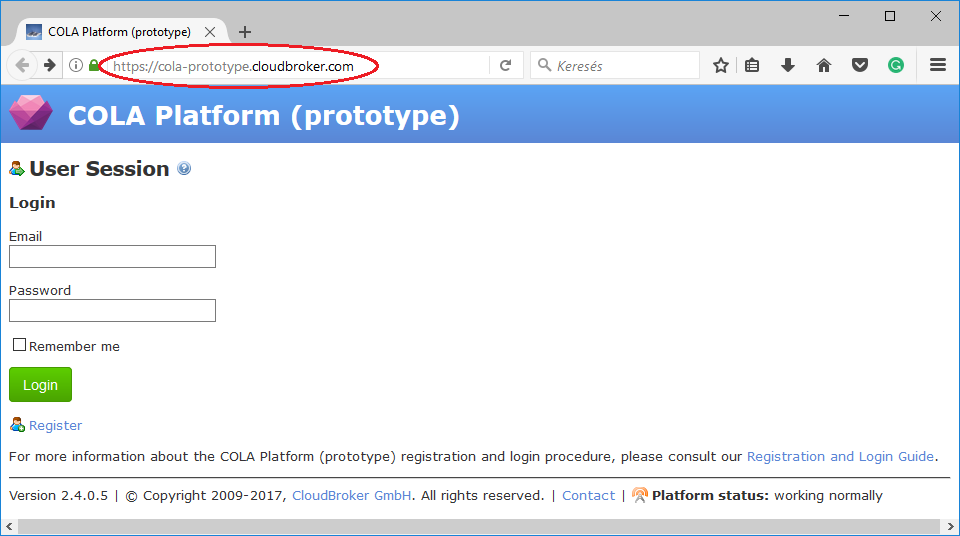
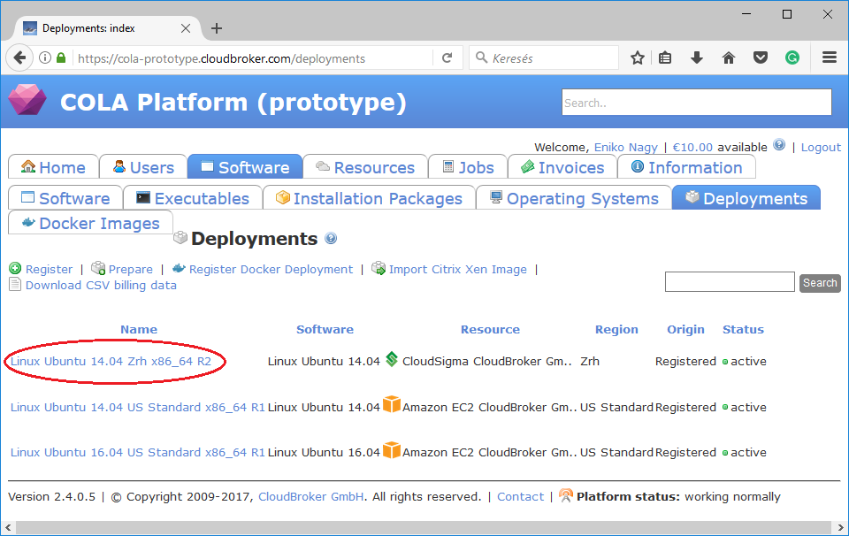
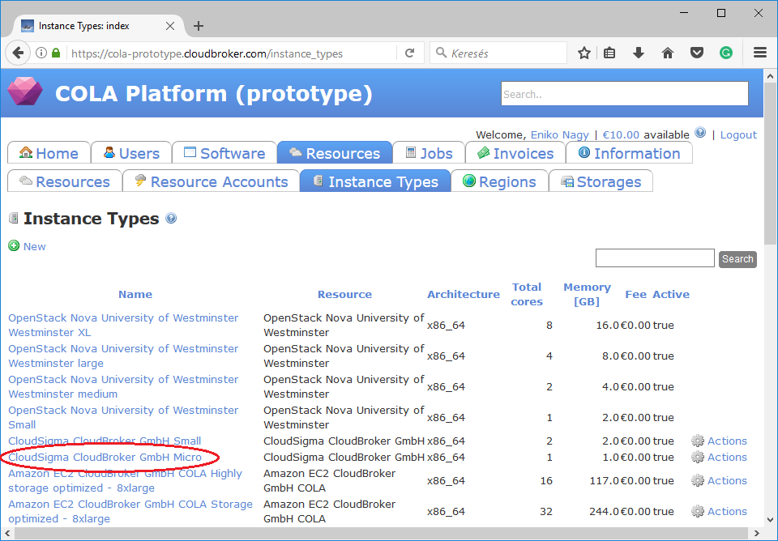
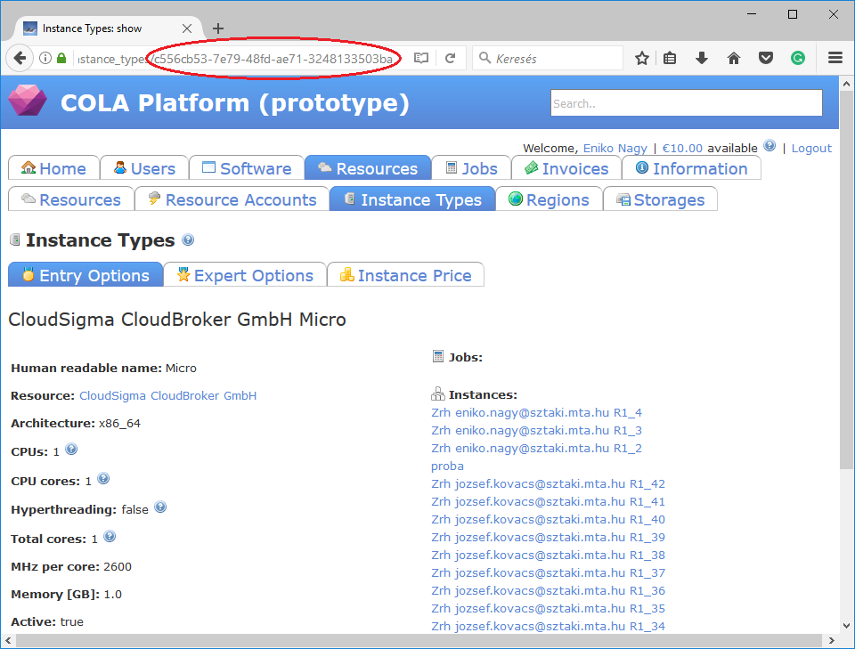
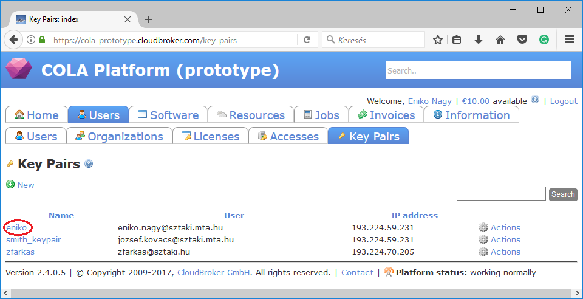

Cloudbroker
===============================

.. _collect_cloudbroker:

This tutorial helps users how the attribute values under the resource section in node definition for the cloudbroker plugin can be collected from the web interface of CloudBroker. 

A minimal version of the resource section for CloudBroker may look like as follows:

  .. code:: yaml

          resource:
            type: cloudbroker
            endpoint: replace_with_endpoint_of_cloudbroker_interface
            description:
               deployment_id: replace_with_deployment_id
               instance_type_id: replace_with_instance_type_id
               key_pair_id: replace_with_keypair_id
               opened_port: replace_with_list_of_ports_separated_with_comma
          contextualisation:
            ...

You need to collect the following attributes to complete the resource section:
 #. ``endpoint``
 #. ``deployment_id``
 #. ``instance_type_id``
 #. ``key_pair_id``
 #. ``opened_port``

**endpoint**

The value of this attribute is the url of the CloudBroker REST API interface, which is usually the same as the login url.

As a result, in our case the ``endpoint`` attribute in the resource section will be ``https://cola-prototype.cloudbroker.com``.

**deployment_id**

The value of this attribute is the id of a preregistered deployment in CloudBroker referring to a cloud, image, region, etc. After login to the CloudBroker Web UI, select ``Software/Deployments`` menu.

On this page you can see the list of the preregistered deployments. Make sure the image contains a base os (preferably Ubuntu) installation with cloud-init support! Assuming we need a ``Linux Ubuntu 14.04 on CloudSigma``, click on the name of the deployment. The id is the UUID of the deployment which can be seen in the address bar of your browser. 

.. image:: deployment2.png

As a result, the ``deployment_id`` attribute in the resource section will be ``bcbdca8e-2841-45ae-884e-d3707829f548``.

**instance_type_id**

The value of this attribute is the id of a preregistered instance type in CloudBroker referring to the capacity of the virtual machine to be deployed. Select ``Resources/Instance Types`` menu. On this page you can see the list of available instance types. 

Assuming we need a ``Micro instance type for CloudSigma``, select and click on the instance type. The id is the UUID of the instance type which can be seen in the address bar of your browser when inspecting the details of the instance type. 

As a result, the ``instance_type_id`` attribute in the resource section will be ``c556cb53-7e79-48fd-ae71-3248133503ba``.

**key_pair_id:**

The value of this attribute is id of a preregistered ssh public key in CloudBroker which will be deployed on the virtual machine. To register a new ssh public key, upload one on page under the ``Users/Key Pairs`` menu.

On this page you can see the list of registered keys. Assuming we need the key with name ``“eniko”``, click on the name of the key. The id is the UUID of the key pair which can be seen in the address bar of your browser when inspecting the details of the key pair.

.. image:: key2.png

As a result, the ``key_pair_id`` attribute in the resource section will be ``3e64ab7e-76b4-4e87-9cc7-e56baf322cac``.

**opened_port:**

The opened_port is one or more ports to be opened to the world. This is a string containing numbers separated by comma. Assuming we would like to open ports 80 and 443 for our web server, the ``opened_port`` attribute in the resource section will be ``‘80, 443’``.

The finalised resource section with the IDs collected in the example above will look like this:

 .. code:: yaml

            resource:
              type: cloudbroker
              endpoint: https://cola-prototype.cloudbroker.com/
              description:
                deployment_id: bcbdca8e-2841-45ae-884e-d3707829f548
                instance_type_id: c556cb53-7e79-48fd-ae71-3248133503ba
                key_pair_id: 3e64ab7e-76b4-4e87-9cc7-e56baf322cac
                opened_port: ‘80, 443’
            contextualisation:
              ...

