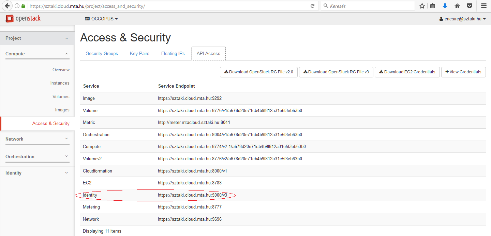
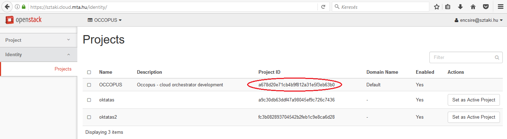
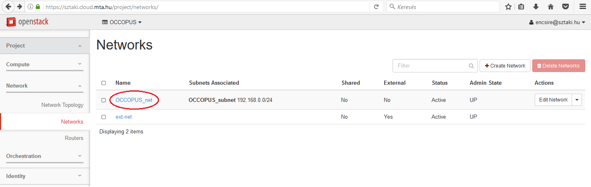
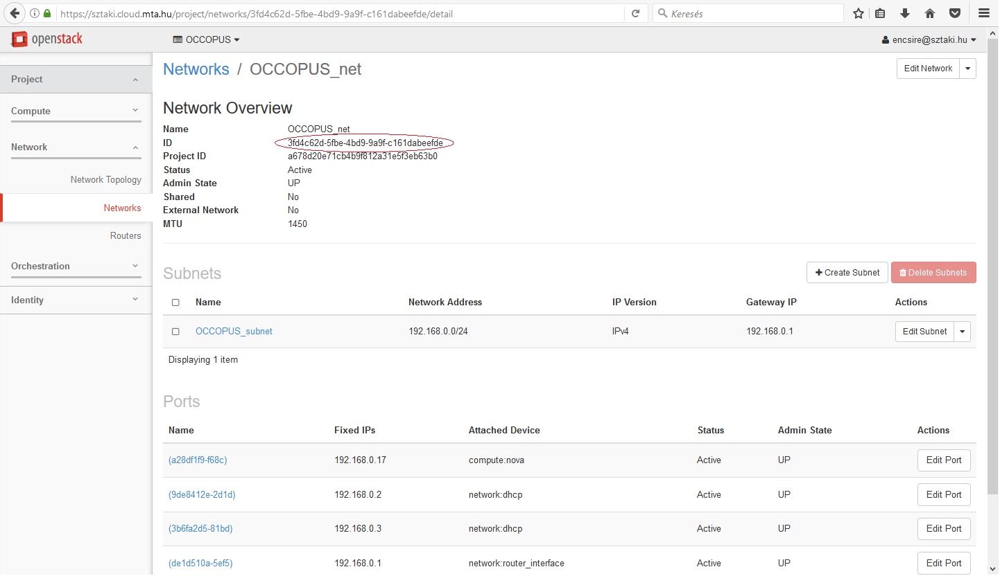
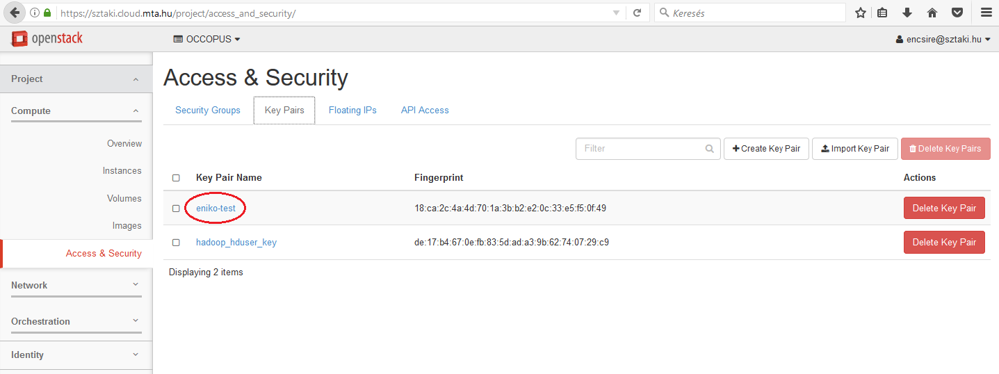
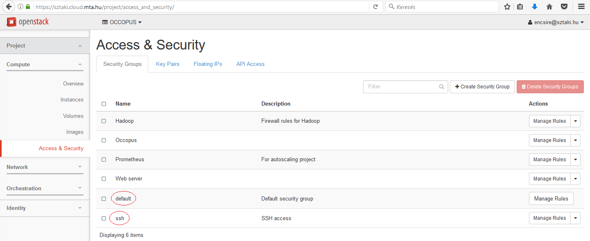

OpenStack Horizon (Nova)
===============================

.. _collect_openstack_horizon:

This tutorial helps users how the attribute values under the resource section in node definition for the nova plugin can be collected from the Horizon web interface of OpenStack. In this help the hungarian `MTA Cloud <https://cloud.mta.hu/>`_ will be taken as an example to show the procedure. 

A minimal version of the resource section for MTA Cloud may look like as follows:

  .. code:: yaml

          resource:
            type: nova
            endpoint: replace_with_endpoint_of_nova_interface_of_your_cloud
            project_id: replace_with_projectid_to_use
            user_domain_name: Default
            image_id: replace_with_id_of_your_image_on_your_target_cloud
            network_id: replace_with_id_of_network_on_your_target_cloud
            flavor_name: replace_with_id_of_the_flavor_on_your_target_cloud
            key_name: replace_with_name_of_keypair_or_remove
            security_groups:
                -
                    replace_with_security_group_to_add_or_remove_section
            floating_ip: add_yes_if_you_need_floating_ip_or_remove
            floating_ip_pool: replace_with_name_of_floating_ip_pool_or_remove
          contextualisation:
            ...

You need to collect the following attributes to complete the resource section:
 #. ``endpoint``
 #. ``project_id``
 #. ``image_id``
 #. ``network_id``
 #. ``flavor_name``
 #. ``key_name``
 #. ``security_groups``

**endpoint**

The endpoint is an url of the nova interface of your OpenStack cloud. After login to the Horizon Web UI, select ``Project/Compute/Access & Security/API Access`` menu. The value of the endpoint is the service endpoint of the *Identity* service. 

.. note::
   
   The nova endpoint for MTA Cloud is: ``https://sztaki.cloud.mta.hu:5000/v3``.

**project_id**

The value of this attribute is an ID referring to a project registered under your account. Select ``Identity/Projects`` menu and a full list of available projects will be listed. Select the proper project and copy its ID found at the *Project ID* column.

We have chosen the OCCOPUS project for which the ``project_id`` attribute in the resource section will be ``a678d20e71cb4b9f812a31e5f3eb63b0``.

**image_id**

The value of this attribute is an ID referring to an image on the cloud to be instantiated to realize a virtual machine. Select ``Project/Compute/Images`` menu and a full list of available images will be listed. 

.. image:: images.png

Assuming we need an ``Ubuntu 14.04 LTS``, click on the name of the image. On the appearing page the ID attribute contains the value we are looking for.

.. image:: images_Ubuntu.png

As a result, the ``image_id`` attribute in the resource section will be ``d4f4e496-031a-4f49-b034-f8dafe28e01c``.

**network_id**

The value of this attribute is an ID refering to the ID of the network to attach to the virtual machine. Select ``Project/Network/Networks``. On this page you can see the list of available networks of your project.

Assuming we need the OCCOPUS_net network, select and click on the network. On the appearing page the ID attribute contains the value we are looking for.

As a result, the ``network_id`` attribute in the resource section will be ``3fd4c62d-5fbe-4bd9-9a9f-c161dabeefde``.

**flavor_name**

The value of this attribute is the ID referring to the type of flavor to be instantiated through nova when realizing a virtual machine. It determines the resources (CPU, memory, storage, networking) of the node. Unfortunately flavor IDs cannot be listed on the webpage, but they can be seen on an instance’s overview page (Choose the ``Project/Compute/Instances`` menu and select one of your instances).

.. image:: instance.png

.. note::

   For MTA Cloud users the following flavor IDs are defined: m1.small („4740c1b8-016d-49d5-a669-2b673f86317c”), m1.medium („3”), m1.large („4”), m1.xlarge („41316ba3-2d8b-4099-96d5-efa82181bb22”)

**key_name**

The value of this attribute is a name refering to a particular public key registered under your account. To register a new ssh keypair, generate or upload one on page under the ``Project/Compute/Access&Security/Key Pairs`` menu. 

On this page you can see the list of registered keys and their fingerprint. Copy the name of your key from the *Key Pair Name* column.

As a result, the ``key_name`` attribute in the resource section will be ``eniko-test``.

**security_groups**

The value of this attribute is a list of security groups referring to particular firewall policies registered under your project. To register a new firewall policy, use the page under the ``Project/Compute/Access & Security`` menu. On this page you can see the list of registered firewall policies.

As a result, the ``security_groups`` attribute in the resource section will be ``default`` and ``ssh``. In ssh policy, port 22 is open. 

The finalised resource section with the IDs collected in the example above will look like this:

  .. code:: yaml

            resource:
              type: nova
              endpoint: https://sztaki.cloud.mta.hu:5000/v3
              project_id: a678d20e71cb4b9f812a31e5f3eb63b0
              user_domain_name: Default
              image_id: d4f4e496-031a-4f49-b034-f8dafe28e01c
              network_id: 3fd4c62d-5fbe-4bd9-9a9f-c161dabeefde
              flavor_name: 3
              key_name: eniko-test
              security_groups: [ default, ssh]
              floating_ip: yes
              floating_ip_pool: ext-net
            contextualisation:
              ...

.. important::

   Collect the IDs under your account instead of using the ones in this example!

.. important::
 
   The resource section must follow YAML syntax! Make sure indentation is proper, avoid using <tab>, use spaces!
