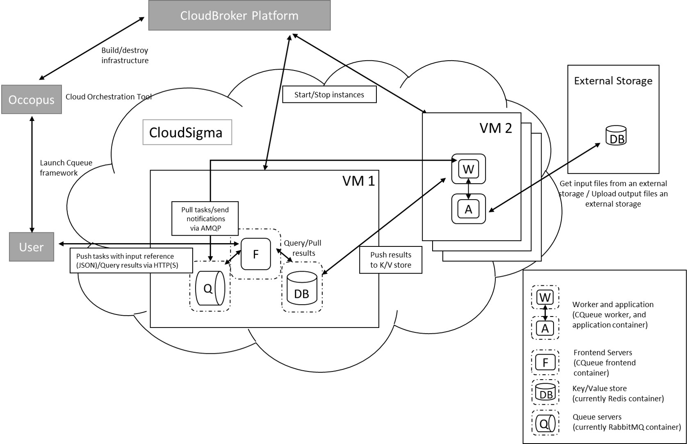

.. _tutorial-building-clusters:

Tutorials on building clusters
==============================

Docker-Swarm cluster
~~~~~~~~~~~~~~~~~~~~

This tutorial sets up a complete Docker infrastructure with Swarm, Docker and Consul software components. It contains a master node and predefined number of worker nodes. The worker nodes receive the ip of the master node and attach to the master node to form a cluster. Finally, the docker cluster can be used with any standard tool talking the docker protocol (on port 2375).

**Features**

 - creating two types of nodes through contextualisation
 - passing ip address of a node to another node
 - using the occi resource handler
 - utilising health check against a predefined port
 - using parameters to scale up worker nodes

**Prerequisites**

 - accessing an Occopus compatible interface 
 - target cloud contains an Ubuntu 14.04 image with cloud-init support

**Download**

You can download the example as `tutorial.examples.docker-swarm <../../examples/docker-swarm.tgz>`_ .

**Steps**

The following steps are suggested to be performed:

#. Open the file ``nodes/node_definitions.yaml`` and edit the resource section of the nodes labelled by ``node_def:``.

   - you must select an `Occopus compatible resource plugin <clouds.html>`_ 
   - you can find and specify the relevant `list of attributes for the plugin <createinfra.html#resource>`_
   - you may follow the help on `collecting the values of the attributes for the plugin <createinfra.html#collecting-resource-attributes>`_
   - you may find a resource template for the plugin in the `resource plugin tutorials <tutorial-resource-plugins.html>`_

   The downloadable package for this example contains a resource template for the Cloudsigma plugin.

#. Components in the infrastructure connect to each other, therefore several port ranges must be opened for the VMs executing the components. Clouds implement port opening various way (e.g. security groups for OpenStack, etc). Make sure you implement port opening in your cloud for the following port ranges:

   .. code::

      TCP 2375 
      TCP 2377
      TCP 7946

   .. note:: 
       Do not forget to open the ports which are needed for your Docker application!

#. Make sure your authentication information is set correctly in your authentication file. You must set your email and password in the authentication file. Setting authentication information is described :ref:`here <authentication>`.

#. Load the node definition for ``dockerswarm_master_node`` and ``dockerswarm_worker_node`` nodes into the database.

   .. important::

      Occopus takes node definitions from its database when builds up the infrastructure, so importing is necessary whenever the node definition (file) changes!

   .. code::

      occopus-import nodes/node_definitions.yaml

#. Update the number of worker nodes if necessary. For this, edit the ``infra-docker-swarm.yaml`` file and modify the ``min`` parameter under the ``scaling`` keyword. Currently, it is set to ``2``.

   .. code::

     - &W
         name: worker
         type: dockerswarm_worker_node
         scaling:
             min: 2

#. Start deploying the infrastructure. Make sure the proper virtualenv is activated!

   .. code::

      occopus-build infra-docker-swarm.yaml

   .. note::

      It may take a few minutes until the services on the master node come to live. Please, be patient!

#. After successful finish, the node with ``ip address`` and ``node id`` are listed at the end of the logging messages and the identifier of the newly built infrastructure is printed. You can store the identifier of the infrastructure to perform further operations on your infra or alternatively you can query the identifier using the **occopus-maintain** command.

   .. code::

     List of nodes/ip addresses:
     master:
       <ip-address> (dfa5f4f5-7d69-432e-87f9-a37cd6376f7a)
     worker:
       <ip-address> (cae40ed8-c4f3-49cd-bc73-92a8c027ff2c)
       <ip-address> (8e255594-5d9a-4106-920c-62591aabd899)
     77cb026b-2f81-46a5-87c5-2adf13e1b2d3

#. Check the result by submitting docker commands to the docker master node!

#. Finally, you may destroy the infrastructure using the infrastructure id returned by ``occopus-build``

   .. code::

      occopus-destroy -i 77cb026b-2f81-46a5-87c5-2adf13e1b2d3

Hadoop cluster
~~~~~~~~~~~~~~

This tutorial sets up a complete Apache Hadoop infrastructure. It contains a Hadoop Master node and Hadoop Slave worker nodes, which can be scaled up or down. To register Hadoop Slave nodes Consul is used.

**Features**

 - creating two types of nodes through contextualisation
 - utilising health check against a predefined port
 - using scaling parameters to limit the number of Hadoop Slave nodes
 - manage cluster nodes with Consul

**Prerequisites**

 - accessing a cloud through an Occopus-compatible interface (e.g EC2, Nova, OCCI, etc.)
 - target cloud contains a base 16.04 Ubuntu OS image with cloud-init support
 - generated ssh key-pair (or for testing purposes one is attached)

**Download**

You can download the example as `tutorial.examples.hadoop-cluster <../../examples/hadoop-cluster.tgz>`_ .

.. note::

   In this tutorial, we will use nova cloud resources (based on our nova tutorials in the basic tutorial section). However, feel free to use any Occopus-compatible cloud resource for the nodes, but we suggest to instantiate all nodes in the same cloud.

**Steps**

#. Open the file ``nodes/node_definitions.yaml`` and edit the resource section of the nodes labelled by ``node_def:``.

   - you must select an `Occopus compatible resource plugin <clouds.html>`_ 
   - you can find and specify the relevant `list of attributes for the plugin <createinfra.html#resource>`_
   - you may follow the help on `collecting the values of the attributes for the plugin <createinfra.html#collecting-resource-attributes>`_
   - you may find a resource template for the plugin in the `resource plugin tutorials <tutorial-resource-plugins.html>`_

   The downloadable package for this example contains a resource template for the Nova plugin.

   .. important::

     Do not modify the values of the contextualisation and the health_check section’s attributes!
 
   .. important::

     Do not specify the server_name attribute for slaves so they are named automatically by Occopus to make sure node names are unique!
 
   .. note::

     If you want Occopus to monitor (health_check) your Hadoop Master and it is to be deployed in a different network, make sure you assign public (floating) IP to the Master node.

#. Components in the infrastructure connect to each other, therefore several port ranges must be opened for the VMs executing the components. Clouds implement port opening various way (e.g. security groups for OpenStack, etc). Make sure you implement port opening in your cloud for the following port ranges:

   .. code::

      TCP 22
      TCP 8025
      TCP 8042
      TCP 8088
      TCP 8300-8600
      TCP 9000
      TCP 50000-51000
 
#. Make sure your authentication information is set correctly in your authentication file. You must set your authentication data for the ``resource`` you would like to use. Setting authentication information is described :ref:`here <authentication>`.

#. Update the number of Hadoop Slave worker nodes if necessary. For this, edit the ``infra-occopus-hadoop.yaml`` file and modifiy the min and max parameter under the scaling keyword. Scaling is the interval in which the number of nodes can change (min, max). Currently, the minimum is set to 2 (which will be the initial number at startup), and the maximum is set to 10.

   .. code::

     - &S
    	name: hadoop-slave
    	type: hadoop_slave_node
    	scaling:
        	min: 2
        	max: 10
 
   .. important::

     Important: Keep in mind that Occopus has to start at least one node from each node type to work properly and scaling can be applied only for Hadoop Slave nodes in this example!

#. Load the node definitions into the database. Make sure the proper virtualenv is activated!

   .. important::

      Occopus takes node definitions from its database when builds up the infrastructure, so importing is necessary whenever the node definition or any imported (e.g. contextualisation) file changes!

   .. code::

      occopus-import nodes/node_definitions.yaml

#. Start deploying the infrastructure.

   .. code::

      occopus-build infra-hadoop-cluster.yaml

#. After successful finish, the nodes with ``ip address`` and ``node id`` are listed at the end of the logging messages and the identifier of the newly built infrastructure is printed. You can store the identifier of the infrastructure to perform further operations on your infra or alternatively you can query the identifier using the **occopus-maintain** command.

   .. code::

      List of nodes/ip addresses:
      hadoop-master:
          192.168.xxx.xxx (3116eaf5-89e7-405f-ab94-9550ba1d0a7c)
      hadoop-slave:
          192.168.xxx.xxx (23f13bd1-25e7-30a1-c1b4-39c3da15a456)
          192.168.xxx.xxx (7b387348-b3a3-5556-83c3-26c43d498f39)

      14032858-d628-40a2-b611-71381bd463fa

#. You can check the  health and statistics of the cluster through the following web pages:

   .. code::
      
      Health of nodes: "http://<HadoopMasterIP>:50070"
      Job statistics: "http://<HadoopMasterIP>:8088"

#. To launch a Hadoop MapReduce job copy your input and executable files to the Hadoop Master node, and perform the submission described `here <https://hadoop.apache.org/docs/stable/hadoop-mapreduce-client/hadoop-mapreduce-client-core/MapReduceTutorial.html>`_ . To login to the Hadoop Master node use the private key attached to the tutorial package:

   .. code::

      ssh -i builtin_hadoop_private_key hduser@[HadoopMaster ip]

#. Finally, you may destroy the infrastructure using the infrastructure id returned by ``occopus-build``

   .. code::

      occopus-destroy -i 14032858-d628-40a2-b611-71381bd463fa

Apache Spark cluster
~~~~~~~~~~~~~~~~~~~~

Apache Spark is a fast and general-purpose cluster computing system. It provides high-level APIs in Java, Scala, Python and R, and an optimized engine that supports general execution graphs. It also supports a rich set of higher-level tools including Spark SQL for SQL and structured data processing, MLlib for machine learning, GraphX for graph processing, and Spark Streaming. For more information visit the `official Apache Spark page <https://spark.apache.org>`_ .  

This tutorial sets up a complete Apache Spark infrastructure. It contains a Spark Master node and Spark Worker nodes, which can be scaled up or down.

**Features**

 - creating two types of nodes through contextualisation
 - utilising health check against a predefined port
 - using scaling parameters to limit the number of Spark Worker nodes

**Prerequisites**

 - accessing a cloud through an Occopus-compatible interface (e.g EC2, Nova, OCCI, etc.)
 - target cloud contains a base 16.04 Ubuntu OS image with cloud-init support

**Download**

You can download the example as `tutorial.examples.spark-cluster <../../examples/spark-cluster.tgz>`_ .

.. note::

   In this tutorial, we will use nova cloud resources (based on our nova tutorials in the basic tutorial section). However, feel free to use any Occopus-compatible cloud resource for the nodes, but we suggest to instantiate all nodes in the same cloud.

**Steps**

#. Open the file ``nodes/node_definitions.yaml`` and edit the resource section of the nodes labelled by ``node_def:``.

   - you must select an `Occopus compatible resource plugin <clouds.html>`_
   - you can find and specify the relevant `list of attributes for the plugin <createinfra.html#resource>`_
   - you may follow the help on `collecting the values of the attributes for the plugin <createinfra.html#collecting-resource-attributes>`_
   - you may find a resource template for the plugin in the `resource plugin tutorials <tutorial-resource-plugins.html>`_

   The downloadable package for this example contains a resource template for the Nova plugin.

   .. important::

     Do not modify the values of the contextualisation and the health_check section’s attributes!

   .. important::

     Do not specify the server_name attribute for workers so they are named automatically by Occopus to make sure node names are unique!

   .. note::

     If you want Occopus to monitor (health_check) your Spark Master and it is to be deployed in a different network, make sure you assign public (floating) IP to the Master node.

#. Components in the infrastructure connect to each other, therefore several port ranges must be opened for the VMs executing the components. Clouds implement port opening various way (e.g. security groups for OpenStack, etc). Make sure you implement port opening in your cloud for the following port ranges:

   .. code::

      TCP 22 
      TCP 4040
      TCP 7077
      TCP 8080
      TCP 8081

#. Make sure your authentication information is set correctly in your authentication file. You must set your authentication data for the ``resource`` you would like to use. Setting authentication information is described :ref:`here <authentication>`.

#. Update the number of Spark Worker nodes if necessary. For this, edit the ``infra-occopus-spark.yaml`` file and modifiy the min and max parameter under the scaling keyword. Scaling is the interval in which the number of nodes can change (min, max). Currently, the minimum is set to 2 (which will be the initial number at startup), and the maximum is set to 10.

   .. code::

     - &W
        name: spark-worker
        type: spark_worker_node
        scaling:
                min: 2
                max: 10

   .. important::

     Important: Keep in mind that Occopus has to start at least one node from each node type to work properly and scaling can be applied only for Spark Worker nodes in this example!

#. Load the node definitions into the database. Make sure the proper virtualenv is activated!

   .. important::

      Occopus takes node definitions from its database when builds up the infrastructure, so importing is necessary whenever the node definition or any imported (e.g. contextualisation) file changes!

   .. code::

      occopus-import nodes/node_definitions.yaml

#. Start deploying the infrastructure.

   .. code::

      occopus-build infra-hadoop-cluster.yaml

#. After successful finish, the nodes with ``ip address`` and ``node id`` are listed at the end of the logging messages and the identifier of the newly built infrastructure is printed. You can store the identifier of the infrastructure to perform further operations on your infra or alternatively you can query the identifier using the **occopus-maintain** command.

   .. code::

      List of nodes/ip addresses:
      spark-master:
          192.168.xxx.xxx (3116eaf5-89e7-405f-ab94-9550ba1d0a7c)
      spark-worker:
          192.168.xxx.xxx (23f13bd1-25e7-30a1-c1b4-39c3da15a456)
          192.168.xxx.xxx (7b387348-b3a3-5556-83c3-26c43d498f39)

      14032858-d628-40a2-b611-71381bd463fa

#. You can check the  health and statistics of the cluster through the following web pages:

   .. code::

      Spark UI: "http://<SparkMasterIP>:8080"
      Application UI: "http://<SparkMasterIP>:4040"

#. You can find examples to test your cluster by submitting an aplication on the Apache Spark cluster `at this site <https://spark.apache.org/docs/latest/submitting-applications.html>`_ .

#. Finally, you may destroy the infrastructure using the infrastructure id returned by ``occopus-build``

   .. code::

      occopus-destroy -i 14032858-d628-40a2-b611-71381bd463fa

DataAvenue cluster
~~~~~~~~~~~~~~~~~~~~

Data Avenue is a data storage management service that enables to access different types of storage resources (including S3, sftp, GridFTP, iRODS, SRM servers) using a uniform interface. The provided REST API allows of performing all the typical storage operations such as creating folders/buckets, renaming or deleting files/folders, uploading/downloading files, or copying/moving files/folders between different storage resources, respectively, even simply using 'curl' from command line. Data Avenue automatically translates users' REST commands to the appropriate storage protocols, and manages long-running data transfers in the background.

In this tutorial we establish a cluster with two nodes types. On the DataAvenue node the DataAvenue application will run, and on a predefined number of storage nodes an S3 storage will run, in order to be able to try DataAvenue file transfer software such as making buckets, download or copy files. We used Ceph and Docker components to build-up the cluster.

**Features**

 - creating two types of nodes through contextualisation
 - using the nova resource handler
 - using parameters to scale up storage nodes

**Prerequisites**

 - accessing an Occopus compatible interface
 - target cloud contains an Ubuntu 16.04 image with cloud-init support

**Download**

You can download the example as `tutorial.examples.dataavenue-cluster <../../examples/dataavenue-cluster.tgz>`_ .

**Steps**

The following steps are suggested to be performed:

#. Open the file ``nodes/node_definitions.yaml`` and edit the resource section of the nodes labelled by ``node_def:``.

   - you must select an `Occopus compatible resource plugin <clouds.html>`_
   - you can find and specify the relevant `list of attributes for the plugin <createinfra.html#resource>`_
   - you may follow the help on `collecting the values of the attributes for the plugin <createinfra.html#collecting-resource-attributes>`_
   - you may find a resource template for the plugin in the `resource plugin tutorials <tutorial-resource-plugins.html>`_

   The downloadable package for this example contains a resource template for the nova plugin.

#. Components in the infrastructure connect to each other, therefore several port ranges must be opened for the VMs executing the components. Clouds implement port opening various way (e.g. security groups for OpenStack, etc). Make sure you implement port opening in your cloud for the following port ranges:

   .. code::

      TCP 22 (SSH)
      TCP 80 (HTTP) 
      TCP 8080

#. Make sure your authentication information is set correctly in your authentication file. You must set your authentication data for the ``resource`` you would like to use. Setting authentication information is described :ref:`here <authentication>`.

#. Update the number of storage nodes if necessary. For this, edit the ``infra-dataavenue.yaml`` file and modify the min and max parameter under the scaling keyword. Scaling is the interval in which the number of nodes can change (min, max). Currently, the minimum is set to 2 (which will be the initial number at startup).

   .. code::

      - &S
        name: storage
        type: storage_node
            scaling:
                min: 2

   .. important::

     Important: Keep in mind that Occopus has to start at least one node from each node type to work properly and scaling can be applied only for storage nodes in this example!

#. Optionally edit the "variables" section of the ``infra-dataavenue.yaml`` file. Set the following attributes:

   - ``storage_user_name`` is the name of the S3 storage user
   - ``access_key`` is the access key of the S3 storage user
   - ``secret_key`` is the secret key of the S3 storage user

#. Load the node definitions into the database. Make sure the proper virtualenv is activated!

   .. important::

      Occopus takes node definitions from its database when builds up the infrastructure, so importing is necessary whenever the node definition or any imported (e.g. contextualisation) file changes!

   .. code::

      occopus-import nodes/node_definitions.yaml

#. Start deploying the infrastructure.

   .. code::

      occopus-build infra-dataavenue.yaml

#. After successful finish, the nodes with ``ip address`` and ``node id`` are listed at the end of the logging messages and the identifier of the newly built infrastructure is printed. You can store the identifier of the infrastructure to perform further operations on your infra or alternatively you can query the identifier using the **occopus-maintain** command.

   .. code::

      List of nodes/ip addresses:
      dataavenue:
          192.168.xxx.xxx (34b07a23-a26a-4a42-a5f4-73966b8ed23f)
      storage:
          192.168.xxx.xxx (29b98290-c6f4-4ae7-95ca-b91a9baf2ea8)
          192.168.xxx.xxx (3ba43b6e-bcec-46ed-bd90-6a352749db5d)

      db0f0047-f7e6-428e-a10d-3b8f7dbdb4d4

#. On the S3 storage nodes a user with predefined parameters will be created. The ``access_key`` will be the Username and the ``secret_key`` will be the Password, which are predefined in the ``infra-dataavenue.yaml`` file. Save user credentials into a file named ``credentials`` use the above command:

   .. code::

     echo -e 'X-Key: 1a7e159a-ffd8-49c8-8b40-549870c70e73\nX-Username: A8Q2WPCWAELW61RWDGO8\nX-Password: FWd1mccBfnw6VHa2vod98NEQktRCYlCronxbO1aQ' > credentials

   .. note::
     This step will be useful to shorten the curl commands later when using DataAvenue!

#. Save the nodes' ip addresses in variables to simplify the use of commands.

   .. code::
     
     export SOURCE_NODE_IP=[storage_a_ip]
     export TARGET_NODE_IP=[storage_b_ip]
     export DATAAVENUE_NODE_IP=[dataavenue_ip]

#. Make bucket on each S3 storage node:

   .. code::

    curl -H "$(cat credentials)" -X POST -H "X-URI: s3://$SOURCE_NODE_IP:80/sourcebucket/" http://$DATAAVENUE_NODE_IP:8080/dataavenue/rest/directory

    curl -H "$(cat credentials)" -X POST -H "X-URI: s3://$TARGET_NODE_IP:80/targetbucket/" http://$DATAAVENUE_NODE_IP:8080/dataavenue/rest/directory

   .. note::
    
    Bucket names should be at least three letter length. Now, the bucket on the source S3 storage node will be ``sourcebucket``, and the bucket on the target S3 storage node will be ``targetbucket``.

#. Check the bucket creation by listing the buckets on each storage node:

   .. code::

     curl -H "$(cat credentials)" -H "X-URI: s3://$SOURCE_NODE_IP:80/" http://$DATAAVENUE_NODE_IP:8080/dataavenue/rest/directory
   
   The result should be: ``["sourcebucket/"]``

   .. code::

     curl -H "$(cat credentials)" -H "X-URI: s3://$TARGET_NODE_IP:80/" http://$DATAAVENUE_NODE_IP:8080/dataavenue/rest/directory

   The result should be: ``["targetbucket/"]``

#. To test the DataAvenue file transfer software you should make a file to be transfered. With this command you can create predefined sized file, now it will be 1 megabyte:
  
   .. code::

      dd if=/dev/urandom of=1MB.dat bs=1M count=1

#. Upload the generated ``1MB.dat`` file to the source storage node:
   
   .. code::
 
      curl -H "$(cat credentials)" -X POST -H "X-URI: s3://$SOURCE_NODE_IP:80/sourcebucket/1MB.dat" -H 'Content-Type: application/octet-stream' --data-binary @1MB.dat http://$DATAAVENUE_NODE_IP:8080/dataavenue/rest/file

#. Check the uploaded file by listing the ``sourcebucket`` bucket on the source node:
   
   .. code::

     curl -H "$(cat credentials)" -H "X-URI: s3://$SOURCE_NODE_IP:80/sourcebucket" http://$DATAAVENUE_NODE_IP:8080/dataavenue/rest/directory

   The result should be: ``["1MB.dat"]``

#. Save the target node's credentials to a ``target.json`` file to shorten the copy command later:

   .. code::

     echo "{target:'s3://"$TARGET_NODE_IP":80/targetbucket/',overwrite:true,credentials:{Type:UserPass, UserID:"A8Q2WPCWAELW61RWDGO8", UserPass:"FWd1mccBfnw6VHa2vod98NEQktRCYlCronxbO1aQ"}}" > target.json

#. Copy the uploaded 1MB.dat file from the source node to the target node:

   .. code::

     curl -H "$(cat credentials)"  -X POST -H "X-URI: s3://$SOURCE_NODE_IP:80/sourcebucket/1MB.dat" -H "Content-type: application/json" --data "$(cat target.json)"  http://$DATAAVENUE_NODE_IP:8080/dataavenue/rest/transfers > transferid

   The result should be: ``[transfer_id]``

#. Check the result of the copy command by querying the ``transfer_id`` returned by the copy command:

   .. code::

     curl -H "$(cat credentials)"  http://$DATAAVENUE_NODE_IP:8080/dataavenue/rest/transfers/$(cat transferid) 

   The following result means a successful copy transfer from the source node to the target node (see status: DONE):

   .. code::

     "bytesTransferred":1048576,"source":"s3://[storage_a_ip]:80/sourcebucket/1MB.dat","status":"DONE","serverTime":1507637326644,"target":"s3://[storage_b_ip]:80/targetbucket/1MB.dat","ended":1507637273245,"started":1507637271709,"size":1048576

#. You can list the files in the target node's bucket, to check the 1MB file:
  
   .. code::

     curl -H "$(cat credentials)" -H "X-URI: s3://$TARGET_NODE_IP:80/targetbucket" http://$DATAAVENUE_NODE_IP:8080/dataavenue/rest/directory

   The result should be: ``["1MB.dat"]``. T

#. Also, you can download the copied file from the target node:

   .. code::

     curl -H "$(cat credentials)" -H "X-URI: s3://$TARGET_NODE_IP:80/targetbucket/1MB.dat" -o download.dat http://$DATAAVENUE_NODE_IP:8080/dataavenue/rest/file

#. Finally, you may destroy the infrastructure using the infrastructure id returned by ``occopus-build``

   .. code::

      occopus-destroy -i db0f0047-f7e6-428e-a10d-3b8f7dbdb4d4

.. note::

   In this tutorial we used HTTP protocol only. DataAvenue also supports HTTPS on port 8443; storages could also be accessed over secure HTTP by deploying e.g. HAPROXY on their nodes.

CQueue cluster
~~~~~~~~~~~~~~~~~~~~

   Figure 1. CQueue cluster architecture

CQueue stands for "Container Queue". Since Docker does not provide pull model for container execution, (Docker Swarm uses push execution model) the CQueue framework provides a lightweight queueing service for executing containers. 

Figure 1 shows, the overall architecture of a CQueue cluster. The CQueue cluster contains one Master node (VM1) and any number of Worker nodes (VM2). Worker nodes can be manually scaled up and down with Occopus. The Master node implements a queue (see "Q" box within VM1), where each item (called task in CQueue) represents the specification of a container execution (image, command, arguments, etc.). The Worker nodes (VM2) fetch the tasks one after the other and execute the container specified by the task (see "A" box within VM2). In each task submission a new Docker container will be launched within at CQueue Worker.

Please, note that CQueue is not aware of what happens inside the container, simply executes them one after the other. CQueue does not handle data files, containers are responsible for downloading inputs and uploading results if necessary. For each container CQueue stores the logs (see "DB" box within VM1), and the return value. CQueue retries the execution of failed containers as well.

In case the container hosts an application, CQueue can be used for executing jobs, where each job is realized by one single container execution. To use CQueue for huge number of job execution, prepare your container and generate the list of container execution in a parameter sweep style.

In this tutorial we deploy a CQueue cluster with two nodes: 1) a Master node (see VM1 on Figure 1) having a RabbitMQ (for queuing) (see "Q" box within VM1), a Redis (for storing container logs) (see "DB" within VM1), and a web-based frontend (for providing a REST API) component (see "F" in VM1); 2) a Worker node (see VM2 on Figure 1) containing a CQueue worker component (see "W" box within VM2) which pulls tasks from the Master and performs the execution of containers specified by the tasks (see "A" box in VM2).

**Features**

 - creating two types of nodes through contextualisation
 - using the nova resource handler
 - using parameters to scale up worker nodes

**Prerequisites**

 - accessing an Occopus compatible interface
 - target cloud contains an Ubuntu 16.04 image with cloud-init support

**Download**

You can download the example as `tutorial.examples.cqueue-cluster <../../examples/cqueue-cluster.tgz>`_ .

**Steps**

The following steps are suggested to be performed:

#. Open the file ``nodes/node_definitions.yaml`` and edit the resource section of the nodes labelled by ``node_def:``.

   - you must select an `Occopus compatible resource plugin <clouds.html>`_
   - you can find and specify the relevant `list of attributes for the plugin <createinfra.html#resource>`_
   - you may follow the help on `collecting the values of the attributes for the plugin <createinfra.html#collecting-resource-attributes>`_
   - you may find a resource template for the plugin in the `resource plugin tutorials <tutorial-resource-plugins.html>`_

   The downloadable package for this example contains a resource template for the CloudBroker plugin.

#. Components in the infrastructure connect to each other, therefore several port ranges must be opened for the VMs executing the components. Clouds implement port opening various way (e.g. security groups for OpenStack, etc). Make sure you implement port opening in your cloud for the following port ranges:

   .. code::

      TCP 22 (SSH)
      TCP 5672 (amqp)
      TCP 6379 (redis server) 
      TCP 8080 (frontend)
      TCP 15672 (RabbitMQ management)

#. Make sure your authentication information is set correctly in your authentication file. You must set your authentication data for the ``resource`` you would like to use. Setting authentication information is described :ref:`here <authentication>`.

#. Update the number of worker nodes if necessary. For this, edit the ``infra-cqueue-cluster.yaml`` file and modify the min and max parameter under the scaling keyword. Scaling is the interval, in which the number of nodes can change (min, max). Currently, the minimum is set to 1 (which will be the initial number at startup).

   .. code::

      - &W
        name: cqueue-worker
        type: cqueue-worker_node
            scaling:
                min: 1

   .. important::

     Important: Keep in mind that Occopus has to start at least one node from each node type to work properly and scaling can be applied only for worker nodes in this example!

#. Load the node definitions into the database. Make sure the proper virtualenv is activated!

   .. important::

      Occopus takes node definitions from its database when builds up the infrastructure, so importing is necessary whenever the node definition or any imported (e.g. contextualisation) file changes!

   .. code::

      occopus-import nodes/node_definitions.yaml

#. Start deploying the infrastructure.

   .. code::

      occopus-build infra-cqueue-cluster.yaml

#. After successful finish, the nodes with ``ip address`` and ``node id`` are listed at the end of the logging messages and the identifier of the newly built infrastructure is printed. You can store the identifier of the infrastructure to perform further operations on your infra or alternatively you can query the identifier using the **occopus-maintain** command.

   .. code::

      List of nodes/ip addresses:
      cqueue-worker:
          192.168.xxx.xxx (34b07a23-a26a-4a42-a5f4-73966b8ed23f)
      cqueue-master:
          192.168.xxx.xxx (29b98290-c6f4-4ae7-95ca-b91a9baf2ea8)

      db0f0047-f7e6-428e-a10d-3b8f7dbdb4d4

#. After a successful built, tasks can be sent to the CQueue master. The framework is built for executing Docker containers with their specific inputs. Also, environment variables and other input parameters can be specified for each container. The CQueue master receives the tasks via a REST API and the CQueue workers pull the tasks from the CQueue master and execute them. One worker process one task at a time.

   Push 'hello world' task (available parameters: image string, env []string, cmd []string, container_name string):

   .. code::

     curl -H 'Content-Type: application/json' -X POST -d'{"image":"ubuntu", "cmd":["echo", "hello Docker"]}' http://<masterip>:8080/task
   

   The result should be: ``{"id":"task_324c5ec3-56b0-4ff3-ab5c-66e5e47c30e9"}``
 
   .. note::

     This id (task_324c5ec3-56b0-4ff3-ab5c-66e5e47c30e9) will be used later, in order to query its status and result.

#. The worker continuously updates the status (pending, received, started, retry, success, failure) of the task with the task’s ID. After the task is completed, the workers send a notification to the CQueue master, and this task will be removed from the queue. The status of a task and the result can be queried from the key-value store through the CQueue master.

   Check the result of the push command by querying the ``task_id`` returned by the push command:

   .. code::

     curl -X GET http://<masterip>:8080/task/$task_id

   The result should be: ``{"status":"SUCCESS"}``

#. Fetch the result of the push command by querying the ``task_id`` returned by the push command:
   
   .. code::

     curl -X GET http://<masterip>:8080/task/$task_id/result
    
   The result should be: ``hello Docker``

#. Delete the task with the following command:

   .. code::

     curl -X DELETE http://<masterip>:8080/task/$task_id

#. For debugging, check the logs of the container at the CQueue worker node.
    
   .. code::

      docker logs -f $(containerID)

#. Finally, you may destroy the infrastructure using the infrastructure id returned by ``occopus-build``

   .. code::
      
      occopus-destroy -i db0f0047-f7e6-428e-a10d-3b8f7dbdb4d4

   .. note::
     
      The CQueue master and the worker components are written in golang, and they have a shared code-base. The open-source code is available `at GitLab <https://gitlab.com/lpds-public/documents/tree/master/COLA/cqueue>`_ .
